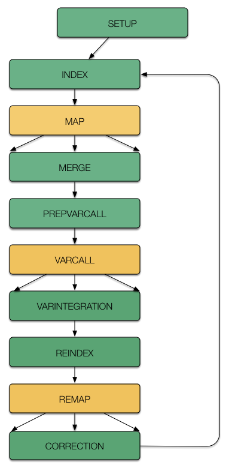

# raccoon - A scalable reference assembly error correction pipeline

***THIS IS AN EARLY AND BUGGY ALPHA RELEASE NOT INTENDED FOR DISTRIBUTION!***

### What does raccoon do?

Raccoon is an automated pipeline that is intended to be deployed as the last step of a reference genome assembly in order to correct base substitutions and small indels ('polishing'). It takes as input the raw data used to assemble the reference, as well as the assembly. The reads used to perform variant calls of single nucleotide variants and short (<7bp) indels. After hard filtering, the called variants are integrated into the reference and the raw data is remapped onto the modifed assembly. Decreases in observed read depths of full length matching reads in regions were a variant has been integrated are used as a criterium to reject wronlgy performed error corrections. This process is performed iteratively.
Polishing reference assemblies is currently particularly important for regions where PacBio data has been used, as these contain an elevated amount of indels even after self correction with quiver. 

### More details..

Raccoon is implemeted as a driver with accessory scripts, that executes or automatically submits to a distributed cluster. One pass of error corrections is comprised of 12 stages, with one additionall setup stage that only needs to be executed once. Wherever possible, the stages have been parallelized via a scatter-gather approach to make error corrections of large genomes feasible. Each stage automatically executes the follwing one until it hits a scattered stage. These scattered stages are highlited in yellow in the follwing schmee. The user only needs to execute stages follwing a scattered stage.

This algorythm has been described by 

### Instalation

Racoon is written in python 3 (tested with version 3.4). It currently depends on the follwing external programs (parenthesis denote the version used in development. This are the versions you should use, any other ones are not guaranteed to work):

- samtools (v1.2)
- bwa (v0.7.8)
- picardtools (v.1.136)
- gatk (v3.4)

Furthermore, the follwing non-default python3 modules are required:

- pysam (v.0.8.3)
- pyvcf (v.0.6.7)

